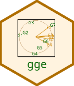

# gge 

[](https://cran.r-project.org/package=gge)
[](https://cranlogs.r-pkg.org/badges/gge)


Functions for GGE (genotype plus genotype-by-environment) and GGB (genotype plus genotype-by-block-of-environments) biplots.

Key features:

* Stable, well-tested.

* Many options to control graphic appearance.

## Installation

```R
# Install the released version from CRAN:
install.packages("gge")

# Install the development version from GitHub:
install.packages("devtools")
devtools::install_github("kwstat/gge")
```
## Usage

Vignette:
[Genotype plus Genotype-By-Block-of-Environments Biplots](https://rawgit.com/kwstat/gge/master/vignettes/gge_examples.html)

In the exmple GGE biplot below, the genotypes are shown by green labels and the environments are shown by blue/gold labels. Each color determines a mega-environment or block-of-environments.  A thick, solid line is drawn from the origin to the 'average' of the environments within each block, and then a thinner line is drawn from the average to the individual environments.  These 'residual' vectors show the deviations within each group.  A dashed line extends to the edge of the plotting window and labels the group.


